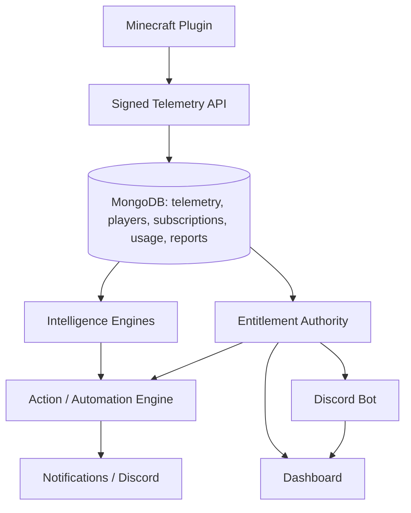

# ProMcBot Product Architecture

ProMcBot is structured as one platform with the existing Discord bot and dashboard preserved as clients of shared backend state. The Minecraft plugin is a secure telemetry agent, not an independent business-logic host.

The central model is guild scoped, network scoped where configured, server scoped, and instance scoped. `Subscription` and `entitlements.js` are the plan source of truth. Telemetry events feed server intelligence, player journey/retention calculations, weekly reports, and evidence-backed automation. Billing changes subscription state only after provider webhook verification.

The current deployment is a Node/Express process with MongoDB and a process-local automation interval. It is safe for the current single-process deployment but must be replaced by a shared-state worker and idempotent distributed lock before horizontal scaling.
