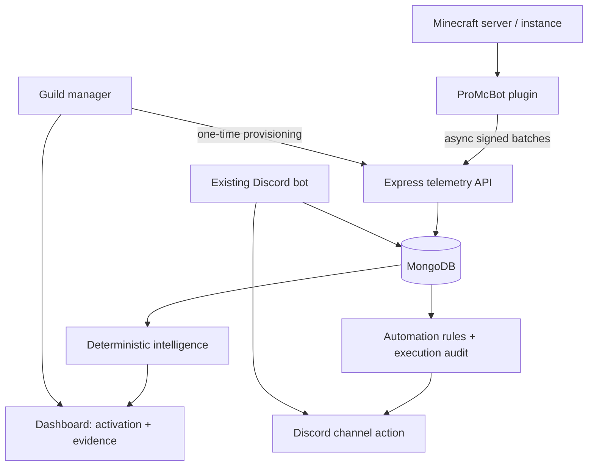

# ProMcBot Platform Architecture

The default branch now contains an incremental platform foundation that preserves the existing Discord bot/dashboard while introducing a first-party Minecraft telemetry boundary.

## Product loop implementation

| Loop step | Current implementation |
|---|---|
| Connect | Dashboard guild access and one-time plugin provisioning. |
| Understand | Plugin join/leave/count/heartbeat telemetry stored by server and instance. |
| Detect | Two-window deterministic activity/session/returning-player comparisons. |
| Explain | Every analysis includes sample, confidence, interpretation, and evidence. |
| Recommend | Recommendations are emitted only when a measured threshold is met. |
| Act | A configured automation rule may send an explicit Discord message. |
| Measure | Automation execution and telemetry are stored with timestamps and expiry. |
| Learn | Current slice stores evidence for future analysis; predictive/AI learning is not implemented. |

## Boundaries and safety

The plugin never owns the Minecraft server's gameplay control path. All network work is asynchronous, requests are bounded and signed, credentials are runtime-provisioned, and the local queue is finite. If ProMcBot is unavailable, the Minecraft server remains playable and only telemetry freshness is affected.

The backend is currently a Node/Express process with MongoDB and process-local automation scheduling. The model is server- and instance-scoped so it is not architecturally limited to a single server, but horizontal multi-instance operation is not claimed as complete until a distributed scheduler, shared cache strategy, and production benchmark are added and tested.
