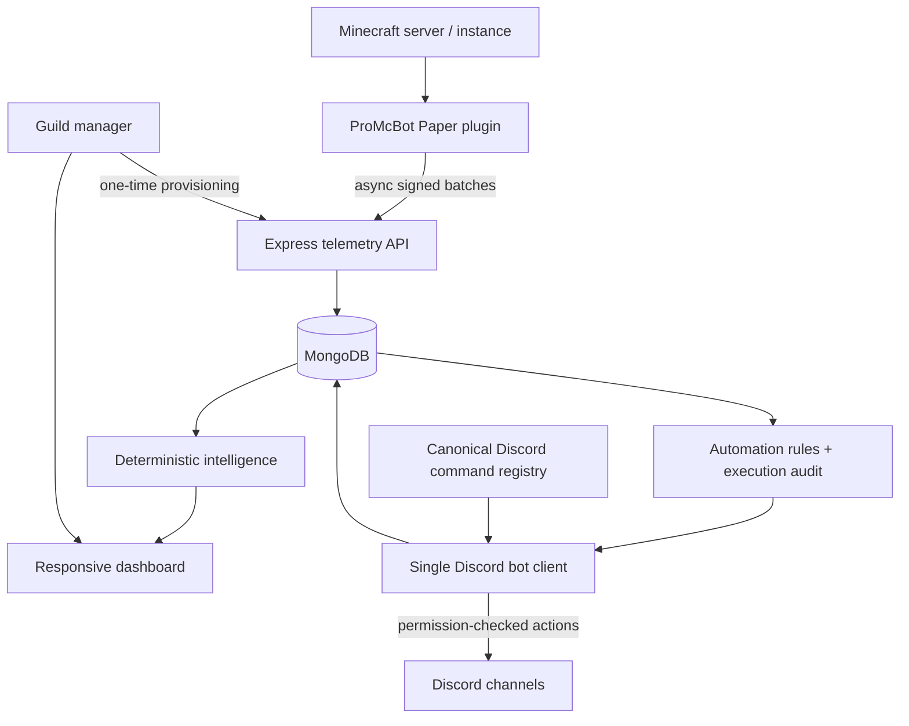

# ProMcBot architecture

The default branch contains one coordinated platform boundary for the Discord bot, dashboard, backend, MongoDB, and first-party Minecraft plugin. The design preserves the existing Node/Express architecture while removing duplicate command/event loaders and keeping measured data as the source of truth.

## Product loop

| Loop step | Current implementation |
|---|---|
| Connect | Dashboard guild access and one-time signed plugin provisioning |
| Understand | Join, leave, aggregate count, heartbeat telemetry scoped by server and instance |
| Detect | Two-window deterministic activity/session/returning-player comparisons |
| Explain | Confidence, sample sizes, interpretation, and evidence accompany analysis |
| Recommend | Threshold-based recommendations are emitted only when measured evidence exists |
| Act | Permission-checked Discord actions and optional automation rules |
| Measure | Telemetry, automation executions, notifications, and audit records are timestamped |
| Return | Dashboard activation steps and weekly intelligence provide an operational reason to return |

## Runtime boundaries

`bot/index.js` creates the single Discord client and stores it as `global.__botClient` for the dashboard to resolve lazily. The dashboard no longer creates a second client or logs in with the same bot token. This avoids duplicate sessions and keeps guild caches and event handling under one owner.

`bot/commands/commandCatalog.js` is the only public command taxonomy. The slash loader registers eight top-level groups and clears stale guild commands before global synchronization. `messageCreate.js` is the only message event for prefix handling and AutoMod; the duplicate AutoMod event loader was removed.

The plugin never owns the Minecraft gameplay control path. Bukkit reads stay on the primary thread, network requests run asynchronously, credentials are runtime-provisioned, and the local queue is finite. When ProMcBot is unavailable, gameplay remains usable and only telemetry freshness is affected.

The backend starts in an explicit degraded mode when MongoDB, OAuth, or bot credentials are absent. It does not fabricate data in that mode. Production requires persistent MongoDB, Discord OAuth, and bot credentials for the corresponding features. Automation scheduling remains process-local; a distributed scheduler and shared cache would be required before claiming horizontal multi-instance execution.
